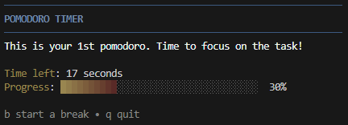
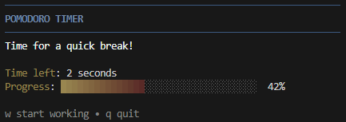
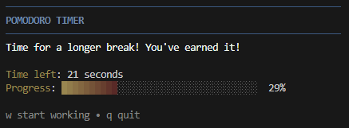

# CLI Pomodoro

> The Pomodoro Technique is a time management method developed by Francesco Cirillo in the late 1980s. It uses a timer to break work into intervals, typically 25 minutes in length, separated by short breaks. Each interval is known as a pomodoro, from the Italian word for tomato, after the tomato-shaped kitchen timer Cirillo used as a university student.

A command line Pomodoro timer made with [Go](https://go.dev/). 

## Configuration

Copy `config.example` to `config.json`. Modify the default values if needed.

| key                       | description                              |
|-------------------------- |----------------------------------------- |
| work_duration_mins        | Working inteval duration in minutes      |
| short_break_duration_mins | Short break interval duration in minutes |
| long_break_duration_mins  | Long break interval duration in minutes  |
| short_breaks              | Number of short breaks before a long one |
| send_notification         | Send a OS notifications                  |

## How to run

The only requirement is [Go](https://go.dev/). 

You can start the app with `go run .`

You start your working interval with `w` and break interval with `b`. To quit the application, hit `q`.

## Preview

